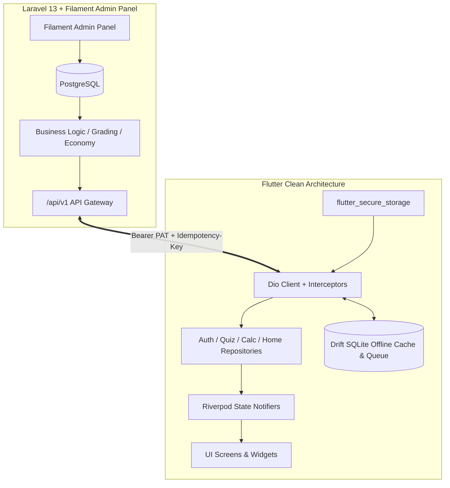

# BiSaaS / CivilCal Flutter App Implementation Plan

## Goal
Build and scale the production-ready, market-dominating **CivilCal Flutter mobile client** (`c:\laragon\www\bisaasmobile`) over the authoritative Laravel 13 / Filament backend (`C:\laragon\www\bisaas`), strictly following the canonical master plans in [`C:\laragon\www\bisaas\docs\mobileapp\`](file:///C:/laragon/www/bisaas/docs/mobileapp) (`BISAAS_FLUTTER_COMPLETE_MASTER_PLAN_v1.0_2026-08-29.md`, `FLUTTER_APP_MASTER_PLAN_2026.md`, `mobileapp-design-reserch-flutter.md`, and `MOBILE_API_INTEGRATION_GUIDE.md`).

---

## Architecture & Boundary Enforcement

> [!IMPORTANT]
> **Boundary Rule (Non-Negotiable):**
> * **Backend (`C:\laragon\www\bisaas`):** Source of truth for ALL business logic, question banks, Loksewa/PSC exam blueprints, SM-2 retention algorithms, coin economy/minting, streak calculations, leaderboards, fraud detection, and subscription validation.
> * **Client (`C:\laragon\www\bisaasmobile`):** Responsible for presentation ("pixels, animations, local state, offline queue, push handling"). Flutter never grades quizzes, computes formulas without server sync, or mints coins locally.



---

## User Review Required

> [!IMPORTANT]
> **Key Architecture Decisions for Phase 1 & 2 Execution:**
> 1. **Phase 1 Foundation Execution:** We will execute Tasks 1 through 6 first (freezing error codes against `MOBILE_API_INTEGRATION_GUIDE.md`, hardening Dio interceptors, implementing secure `TokenManager`, wiring `StatefulShellRoute` 5-tab navigation, creating full `auth` presentation/domain/data layers, and expanding design tokens).
> 2. **Dev Environment Host:** Default dev environment is set to `https://bisaas.test` (or `http://10.0.2.2` when running against Android emulator).
> 3. **Non-Streaming AI Policy:** Non-streaming endpoint `POST /learning/tutor` is used for mobile as per contract specification.

---

## Open Questions

> [!NOTE]
> 1. **Firebase Configuration:** Firebase native configs (`google-services.json` and `GoogleService-Info.plist`) are currently stubbed/guarded for dev. Do you have active Firebase project configuration files ready, or should we proceed with dev-guarded fallback for offline/local development?
> 2. **Execution Strategy:** Would you prefer implementing Phase 1 in one structured batch with full test verification (`flutter test` + `flutter analyze`), or step-by-step per task?

---

## Proposed Changes & Phased Execution

Grouped logically by phases following the master roadmap:

### Phase 1: Foundation Slice (Tasks 1 - 6)

#### Core Network & Configuration Hardening
- **[MODIFY] [api_config.dart](file:///c:/laragon/www/bisaasmobile/lib/app/config/api_config.dart)**: Ensure `/api/v1` base URL, default headers, and timeouts.
- **[MODIFY] [api_exception.dart](file:///c:/laragon/www/bisaasmobile/lib/core/network/api_exception.dart)**: Sync `ApiErrorCode` registry with `App\Http\Support\ApiErrorCode`.
- **[MODIFY] [dio_client.dart](file:///c:/laragon/www/bisaasmobile/lib/core/network/dio_client.dart)**: Ensure `X-Request-Id`, 429 exponential backoff with `Retry-After`, and dev certificate bypass.
- **[MODIFY] [token_manager.dart](file:///c:/laragon/www/bisaasmobile/lib/core/security/token_manager.dart)**: Secure token lifecycle, proactive refresh (<7 days), and `X-Device-Name` tracking.

#### Router & App Shell
- **[NEW] [shell_router.dart](file:///c:/laragon/www/bisaasmobile/lib/app/router/shell_router.dart)**: `StatefulShellRoute` with 5 persistent tabs (Home, Quiz, Calculators, Courses, Profile).
- **[MODIFY] [app_router.dart](file:///c:/laragon/www/bisaasmobile/lib/app/router/app_router.dart)**: Wire shell route, auth guards, and deep links (`civilcal://`).
- **[NEW] [splash_screen.dart](file:///c:/laragon/www/bisaasmobile/lib/features/auth/presentation/screens/splash_screen.dart)**: Cold-start sequence (`GET /api/v1/app/config` check + `/api/v1/me` validation).

#### Complete Auth Feature (Clean Architecture)
- **[NEW] [user.dart](file:///c:/laragon/www/bisaasmobile/lib/features/auth/domain/entities/user.dart)**: Pure Dart entity for authenticated user.
- **[NEW] [auth_response_dto.dart](file:///c:/laragon/www/bisaasmobile/lib/features/auth/data/models/auth_response_dto.dart)**: Freezed DTO mapping `{token, token_type, expires_at, user}`.
- **[NEW] [auth_remote_data_source.dart](file:///c:/laragon/www/bisaasmobile/lib/features/auth/data/datasources/auth_remote_data_source.dart)**: Calls `/auth/login`, `/auth/register`, `/auth/refresh`, `/auth/logout`.
- **[NEW] [auth_repository_impl.dart](file:///c:/laragon/www/bisaasmobile/lib/features/auth/data/repositories/auth_repository_impl.dart)**: Implementation of domain `AuthRepository`.
- **[NEW] [auth_controller.dart](file:///c:/laragon/www/bisaasmobile/lib/features/auth/presentation/controllers/auth_controller.dart)**: Riverpod `AsyncNotifier<AuthState>`.
- **[MODIFY] [login_page.dart](file:///c:/laragon/www/bisaasmobile/lib/features/auth/presentation/login_page.dart)**: Production UI with validation, error states, and responsive design.
- **[NEW] [register_page.dart](file:///c:/laragon/www/bisaasmobile/lib/features/auth/presentation/screens/register_screen.dart)**: Account creation screen.
- **[NEW] [forgot_password_page.dart](file:///c:/laragon/www/bisaasmobile/lib/features/auth/presentation/screens/forgot_password_screen.dart)**: Password reset request screen.

#### Design System & Internationalization
- **[MODIFY] [app_colors.dart](file:///c:/laragon/www/bisaasmobile/lib/app/theme/app_colors.dart)**: Complete palette (Dark #0B0F17, Brand #22D3EE, XP Gold #EAB308, Glass tints).
- **[MODIFY] [app_en.arb](file:///c:/laragon/www/bisaasmobile/lib/l10n/app_en.arb)**, **[app_ne.arb](file:///c:/laragon/www/bisaasmobile/lib/l10n/app_ne.arb)**, **[app_hi.arb](file:///c:/laragon/www/bisaasmobile/lib/l10n/app_hi.arb)**: Complete localization keys.

---

### Phase 2: Home & Quiz Flagship (Tasks 7 - 12)
- **Home Dashboard**: Real data aggregation (`GET /api/v1/dashboard`), Daily Quiz Card, Streak tracker, Quick Actions grid.
- **Quiz Data & Domain**: DTOs, pure domain entities, server-authoritative submission with `Idempotency-Key`.
- **Quiz State Machine**: Riverpod controller with isolated timer updates (preventing full question rebuilds), 0ms selection responsiveness, combo streak pill, results ring, review screen.

---

### Phase 3: Calculators & Gamification (Tasks 13 - 14)
- **Calculator Engine**: Metadata-driven dynamic input/output renderer for the 232 backend engineering calculator endpoints.
- **Gamification HUD**: XP bar, coin counters, level badges, and achievement unlock overlays.

---

## Verification Plan

### Automated Tests
1. **Unit & Data Tests:**
   ```bash
   flutter test test/core/network/dio_retry_test.dart
   flutter test test/core/security/token_manager_test.dart
   flutter test test/features/auth/auth_controller_test.dart
   ```
2. **Static Analysis & Linting:**
   ```bash
   flutter analyze
   ```
3. **Build Verification:**
   ```bash
   flutter build web --dart-define=ENV=dev
   ```

### Manual Verification
- Verify splash screen transitions smoothly to `/login` when unauthenticated.
- Verify sign-in flow persists token to `TokenManager` and navigates to the 5-tab shell route.
- Verify network requests attach `Accept: application/json`, `X-Request-Id`, and Bearer tokens.
