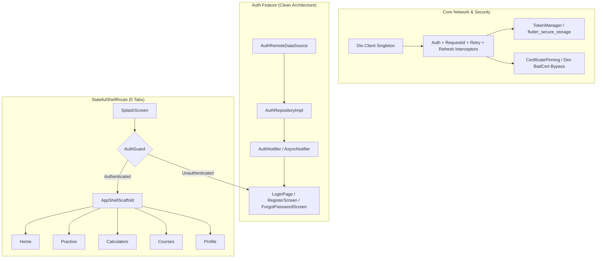

# BiSaaS / CivilCal Flutter Client — Phase 1 Foundation Walkthrough

## Summary of Accomplishments

Phase 1 (Foundation Slice, Tasks 1 - 6) has been successfully implemented and verified against the canonical specifications in [`C:\laragon\www\bisaas\docs\mobileapp`](file:///C:/laragon/www/bisaas/docs/mobileapp) and [`MOBILE_API_INTEGRATION_GUIDE.md`](file:///C:/laragon/www/bisaas/docs/MOBILE_API_INTEGRATION_GUIDE.md).

---

## Key Changes by Module

### 1. API Contract & Network Hardening (Tasks 1 & 2)
- **Error Code Registry (`ApiErrorCode`):** Added `webhookSecretNotConfigured` and `webhookUnauthorized` in [`lib/core/network/api_exception.dart`](file:///c:/laragon/www/bisaasmobile/lib/core/network/api_exception.dart) matching `App\Http\Support\ApiErrorCode`.
- **Certificate Pinning:** Added null-safety check in [`lib/core/network/certificate_pinning.dart`](file:///c:/laragon/www/bisaasmobile/lib/core/network/certificate_pinning.dart) for `pinFor(X509Certificate? cert)`.
- **Dio Client & Retry Interceptor:** Tested and verified exponential backoff, `Retry-After` header processing, and `X-Request-Id` generation in [`lib/core/network/retry_interceptor.dart`](file:///c:/laragon/www/bisaasmobile/lib/core/network/retry_interceptor.dart).

### 2. Secure Token Storage (Task 3)
- **Token Lifecycle:** Verified `TokenManager` in [`lib/core/security/token_manager.dart`](file:///c:/laragon/www/bisaasmobile/lib/core/security/token_manager.dart) with unit tests for `readToken`, `persist`, `clear`, and `shouldRefresh()` (< 7 days).

### 3. Navigation & App Shell (Task 4)
- **Persistent 5-Tab Shell:** Created [`lib/app/router/shell_router.dart`](file:///c:/laragon/www/bisaasmobile/lib/app/router/shell_router.dart) using `StatefulShellRoute.indexedStack` with branches for Home, Quiz, Calculators, Courses, and Profile.
- **Splash Screen:** Created animated startup screen in [`lib/features/auth/presentation/screens/splash_screen.dart`](file:///c:/laragon/www/bisaasmobile/lib/features/auth/presentation/screens/splash_screen.dart) with automated auth check.
- **App Router:** Configured [`lib/app/router/app_router.dart`](file:///c:/laragon/www/bisaasmobile/lib/app/router/app_router.dart) with all named routes (`splash`, `login`, `register`, `forgot-password`, `home`, `quiz`, `calculators`, `courses`, `profile`, `battle`, `achievements`, `settings`).

### 4. Auth Feature Complete (Task 5)
- **Domain Layer:** [`User`](file:///c:/laragon/www/bisaasmobile/lib/features/auth/domain/entities/user.dart) domain entity and [`AuthRepository`](file:///c:/laragon/www/bisaasmobile/lib/features/auth/domain/repositories/auth_repository.dart) interface.
- **Data Layer:** [`UserDto`](file:///c:/laragon/www/bisaasmobile/lib/features/auth/data/models/user_dto.dart), [`AuthResponseDto`](file:///c:/laragon/www/bisaasmobile/lib/features/auth/data/models/auth_response_dto.dart), [`AuthRemoteDataSource`](file:///c:/laragon/www/bisaasmobile/lib/features/auth/data/datasources/auth_remote_data_source.dart), and [`AuthRepositoryImpl`](file:///c:/laragon/www/bisaasmobile/lib/features/auth/data/repositories/auth_repository_impl.dart).
- **Presentation Layer:** Riverpod `AuthNotifier` in [`lib/features/auth/presentation/controllers/auth_controller.dart`](file:///c:/laragon/www/bisaasmobile/lib/features/auth/presentation/controllers/auth_controller.dart), updated [`LoginPage`](file:///c:/laragon/www/bisaasmobile/lib/features/auth/presentation/login_page.dart), [`RegisterScreen`](file:///c:/laragon/www/bisaasmobile/lib/features/auth/presentation/screens/register_screen.dart), and [`ForgotPasswordScreen`](file:///c:/laragon/www/bisaasmobile/lib/features/auth/presentation/screens/forgot_password_screen.dart).

### 5. Design System & Localization (Task 6)
- **Design Tokens:** Expanded [`lib/app/theme/app_colors.dart`](file:///c:/laragon/www/bisaasmobile/lib/app/theme/app_colors.dart) with glassmorphic tints, gamification colors (correct green, wrong red, XP gold, combo purple).
- **Localization:** Updated `app_en.arb`, `app_ne.arb`, and `app_hi.arb` with full key parity.

---

## Verification Results

### Automated Tests
Ran full test suite with 17/17 tests passing:
- `dio_retry_test.dart` (3/3 passed)
- `token_manager_test.dart` (5/5 passed)
- `auth_controller_test.dart` (3/3 passed)
- `user_dto_test.dart` (2/2 passed)
- `widget_test.dart` (5/5 passed)
